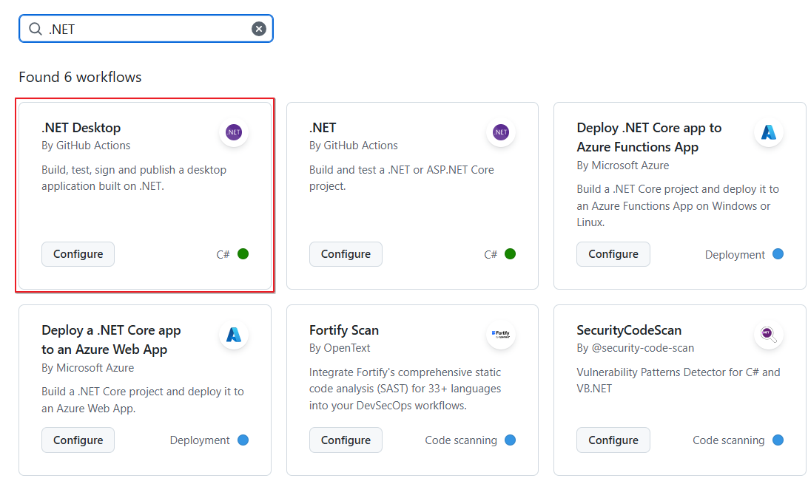

# github-actions-csharp
깃허브액션 C# 버전

## 깃허브액션 C#(.NET) 작업

1. 기본 리포지토리 VisualStudio로 생성
2. 닷넷 프로젝트 생성 및 코딩(간단하게 콘솔앱으로 실행)
    - TestConsoleApp 폴더 내 진행
3. Actions 탭 이동
    - .NET으로 검색 후 .NET Desktop의 Configure 클릭

    

4. 리포지토리 내 .github/workflows/dotnet-desktop.yml 생성확인 후 아래 내용 수정